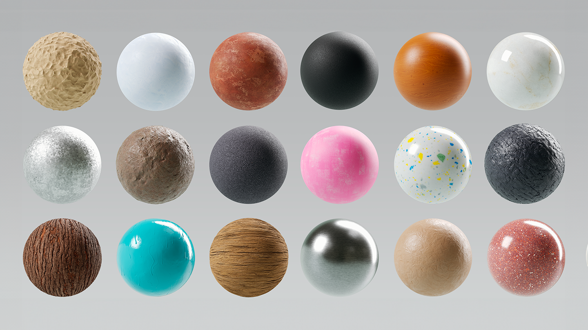
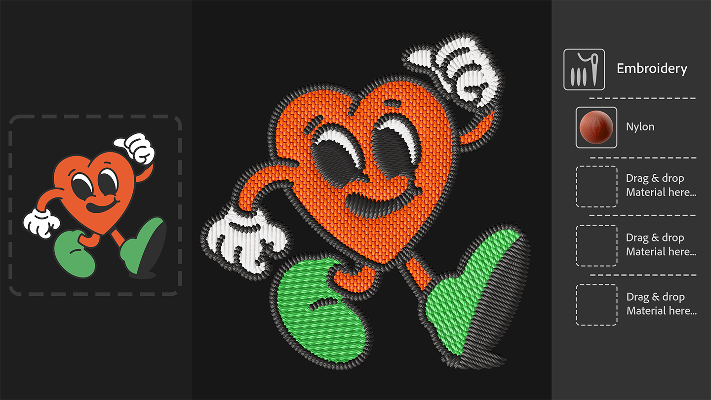
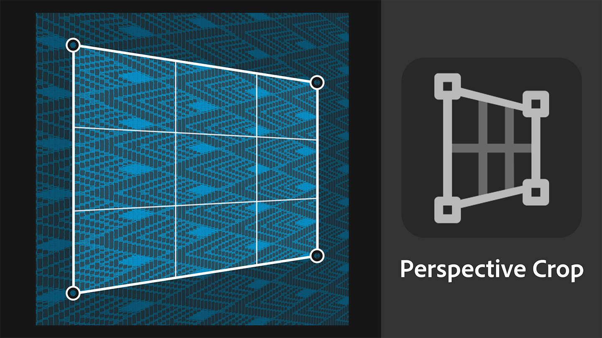

# Neue Starter-Elemente
Die mit Sampler bereitgestellten Materialien wurden aktualisiert. Die neuen eignen sich besser für Industriedesign-Workflows und Mode-Workflows. Digitalkünstler in den Bereichen Medien und Unterhaltung erhalten mehr Kontrolle über die technischen Aspekte der Texturerstellung. 

# Texturgeneratoren
Texturgeneratoren bieten mithilfe von parametrischem Rauschen, Mustern und Grunge-Optionen eine verbesserte Kontrolle über die Materialerstellung. 

# Stickerei
Der Stickereifilter wurde aktualisiert. Dabei wurde seine Stichgenauigkeit verbessert und er unterstützt nun bis zu 8 Farben. Die Materialeingaben befinden sich wieder im Ebenenstapel, wodurch andere Materialien in den Flicken eingefügt werden können. 

# Perspektivisches Freistellen
Mit dem neuen perspektivischen Freistellungswerkzeug können Sie verzerrte Materialien und Scans mit vier Kontrollpunkten zuschneiden, um Perspektivenartefakte zu vermeiden und ein kachelbares Asset zu erhalten.
