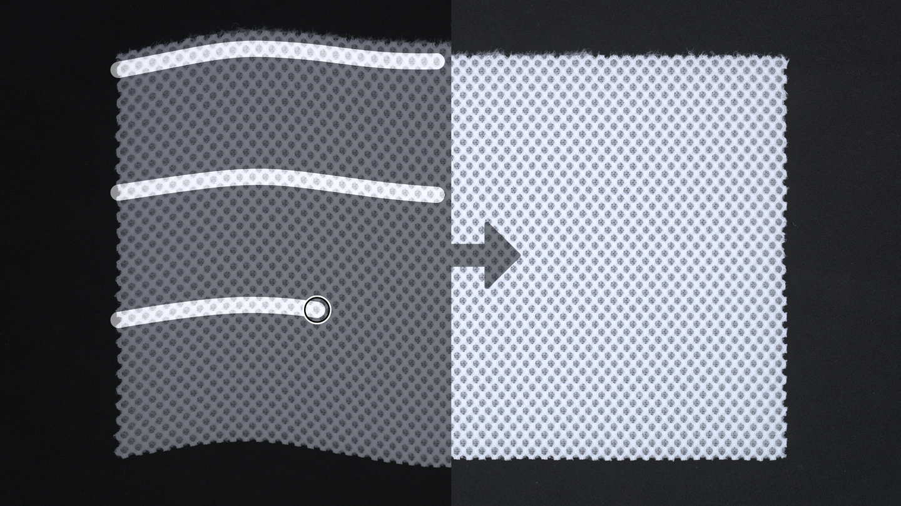
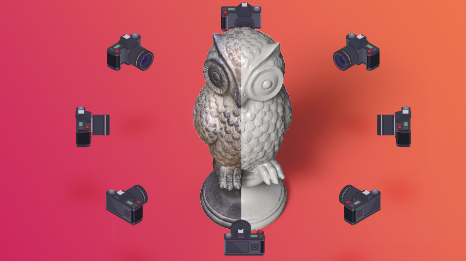

# Deformación de pintura
El filtro Deformación de pintura le permite deformar materiales dibujando curvas en la vista 2D. El filtro también incluye la opción Enderezar para volver a alinear los materiales para un flujo de trabajo con mosaicos fácil y sin problemas.

# Bordado
El nuevo generador Bordado le permite crear parches de bordado a partir de una sola imagen, un archivo vectorial o un dibujo. Puede bordar hasta 6 colores y combina varias técnicas de puntada.

# Mejoras de Captura 3D
Cree objetos 3D a partir de imágenes del mundo real con un flujo de trabajo simple y guiado por IA. Arrastre y suelte las imágenes en el asistente de Captura 3D para comenzar. Nos esforzamos constantemente por mejorar la calidad y estabilidad.
