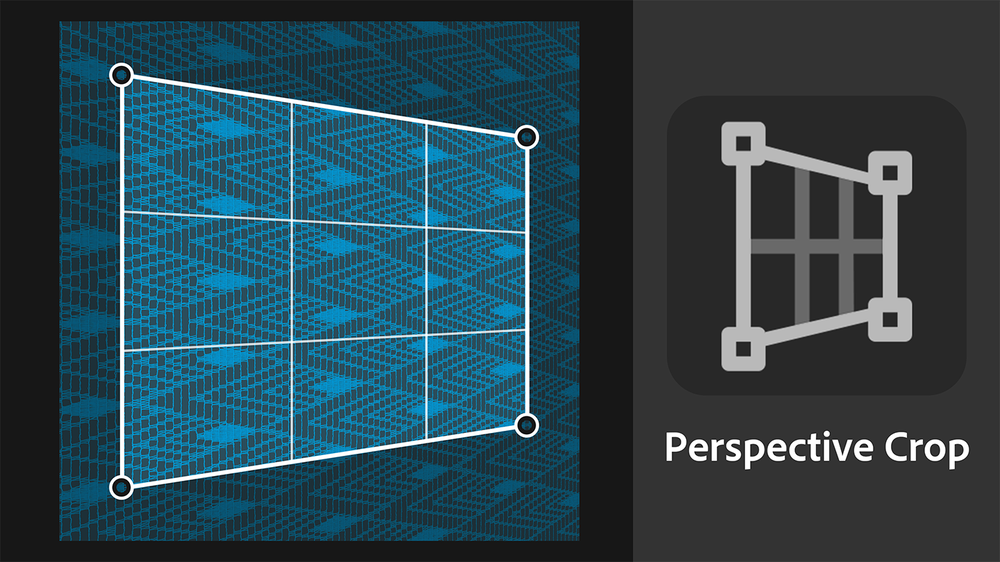

# Nuevos activos de introducción
Los materiales incluidos con Sampler se han actualizado para satisfacer las necesidades de los flujos de trabajo de diseño industrial, de los flujos de trabajo de moda y de los artistas técnicos que trabajan en medios de comunicación y entretenimiento, que ahora tendrán más control sobre los aspectos técnicos de la creación de texturas. 

# Generadores de texturas
Los generadores de textura ofrecen un mejor control sobre la creación de materiales mediante ruidos paramétricos, patrones gráficos y opciones de suciedad. 

# Bordado
El filtro Bordado actualizado tiene una precisión de puntada mejorada y admite hasta 8 colores. Las entradas del material vuelven a estar en la pila de capas, lo que permite la inserción de otros materiales en el parche. 

# Recorte con perspectiva
La nueva herramienta Recorte con perspectiva le permite recortar materiales distorsionados y escanea con cuatro puntos de control para eliminar artefactos de perspectiva y obtener un activo en mosaico.
