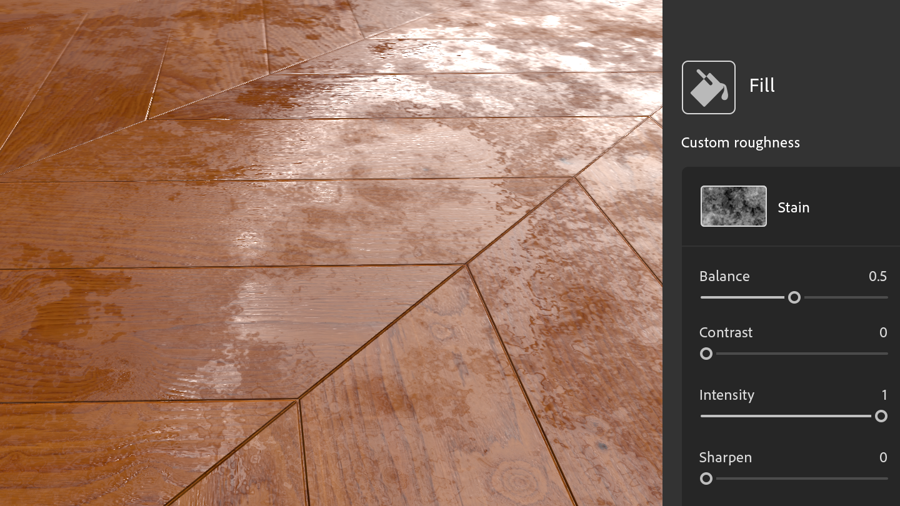

# Nouvelles ressources pour démarrer
Les matériaux inclus avec Sampler ont été mis à jour pour mieux répondre aux besoins des workflows de design industriel et des workflows de la mode, et les technical artists travaillant dans les médias et le divertissement bénéficient désormais d’un meilleur contrôle sur les aspects techniques de la création de textures. 

# Générateurs de textures
Les générateurs de textures offrent un meilleur contrôle sur la création de matériaux à l’aide des options de bruits, de motifs et de grunges paramétriques. 

# Broderie
Le filtre Broderie mis à jour offre une meilleure précision de couture et prend en charge jusqu’à 8 couleurs. Les entrées du matériau ont été rétablies dans la pile de calques, ce qui permet l’insertion d’autres matériaux dans le patch. 

# Correction de perspective par recadrage
Le nouvel outil Correction de perspective par recadrage vous permet de recadrer des matériaux et des numérisations déformés, et inclut quatre points de contrôle pour supprimer les artéfacts de perspective et obtenir une ressource répétable.
