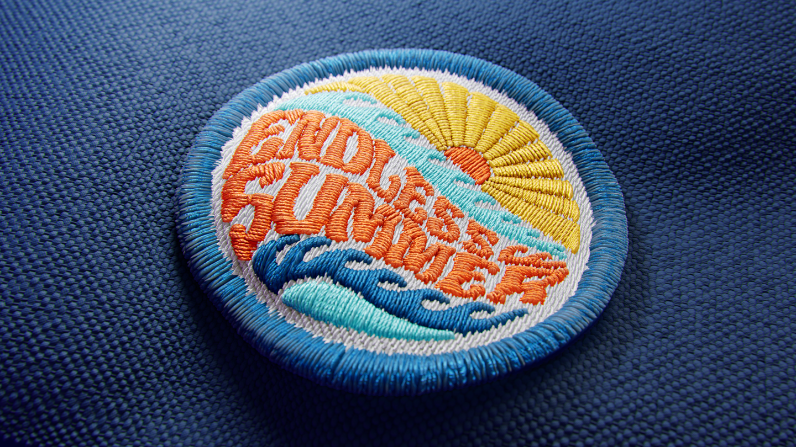
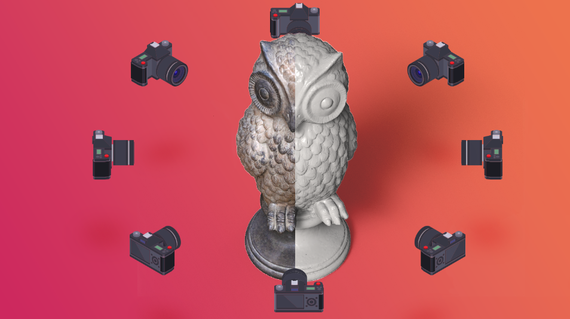

# Alterazione dipinto
Il filtro Alterazione dipinto consente di deformare i materiali disegnando curve nella vista 2D. Il filtro prevede anche l'opzione Raddrizza, per riallineare i materiali per un flusso di lavoro di suddivisione in porzioni semplice e senza interruzioni.

# Ricamo
Il nuovo generatore Ricamo ti consente di creare toppe da ricamo da una singola immagine, file vettoriale o disegno. Può ricamare fino a 6 colori e combina diverse tecniche di cucitura.

# Miglioramenti 3D Capture
Crea oggetti 3D da immagini del mondo reale con un flusso di lavoro semplice gestito dall'intelligenza artificiale. Trascina le immagini nella procedura guidata di Capture 3D per iniziare). Lavoriamo costantemente per migliorare qualità e stabilità.
