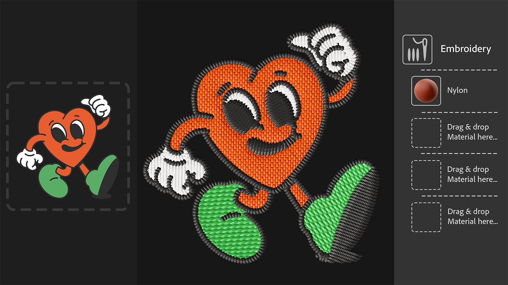

# 새로운 스타터 에셋
Sampler에 포함된 재질이 산업 디자인 워크플로우, 패션 워크플로우, 미디어 및 엔터테인먼트 분야에서 작업하는 기술 아티스트의 요구 사항을 더 잘 충족하도록 업데이트되었습니다. 이제 텍스처 생성 시 기술적인 측면을 더 많이 제어할 수 있습니다. 

# 텍스처 생성기
텍스처 생성기를 사용하면 매개 변수 노이즈, 패턴 및 그런지 옵션을 사용하여 재질 생성을 보다 효과적으로 제어할 수 있습니다. 

# 자수
업데이트된 자수 필터는 스티칭 정밀도가 향상되었으며 최대 8가지 색상을 지원합니다. 재질의 입력은 다시 레이어 스택에 돌아와서 패치에 다른 재질을 삽입할 수 있습니다. 

# 원근 자르기
새로운 원근 자르기 도구를 사용하면 4개의 조절점으로 왜곡된 재질과 스캔을 잘라 원근 아티팩트를 제거하고 타일링 가능한 에셋을 얻을 수 있습니다.

# 텍스트를 텍스처로(Beta)
새로운 방법으로 재질을 생성해 보세요. Creative Cloud 데스크탑의 Beta 앱 섹션에서 사용할 수 있는 Substance 3D Sampler Beta를 사용하여 자세한 텍스트 설명으로 바둑판식 텍스처를 생성합니다.
